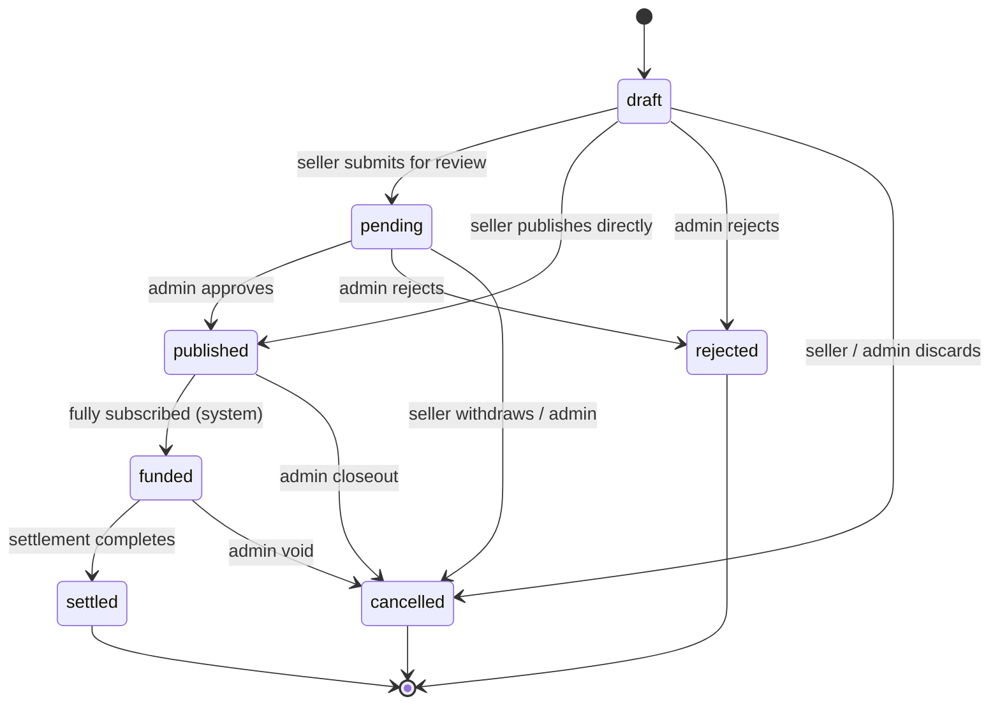

# Invoice Lifecycle

Invoice status changes go through a single state machine,
[`src/lib/invoice-state-machine.ts`](../src/lib/invoice-state-machine.ts). It
enforces the graph, the role allowed to take each step, and each step's
precondition. It also records every change in `invoice_status_history` and runs
side effects exactly once after the change commits.



In the terms used by issue #468: `draft` = submitted, `pending` = under review,
`published` = active.

## Transitions

| From → To                        | Allowed roles         | Precondition                         | Error when it fails                  |
| -------------------------------- | --------------------- | ------------------------------------ | ------------------------------------ |
| `draft → pending`                | seller (owner)        | `validateInvoiceForPublish()` passes | 422 `invoice_not_publishable`        |
| `draft → published`              | seller (owner)        | `validateInvoiceForPublish()` passes | 422 `invoice_not_publishable`        |
| `pending → published`            | admin                 | `validateInvoiceForPublish()` passes | 422 `invoice_not_publishable`        |
| `draft / pending → rejected`     | admin                 | non-empty reason                     | 422 `transition_precondition_failed` |
| `published → funded`             | system                | committed amount ≥ net amount        | 422 `transition_precondition_failed` |
| `funded → settled`               | admin, system         | —                                    | —                                    |
| `draft / pending → cancelled`    | seller (owner), admin | —                                    | —                                    |
| `published / funded → cancelled` | admin                 | —                                    | —                                    |

A transition that is not in the table is rejected with **422
`invalid_status_transition`**. A role that the table does not allow, or a seller
who does not own the invoice, is rejected with **403 `transition_not_permitted`**.
Invoice routes return these errors in a structured form:

```json
{
  "success": false,
  "error": {
    "code": "INVALID_STATUS_TRANSITION",
    "message": "Cannot transition invoice from funded to published. Allowed next statuses from funded: settled, cancelled.",
    "details": {
      "from": "funded",
      "to": "published",
      "allowedTransitions": ["settled", "cancelled"]
    }
  }
}
```

## History

Each transition writes a row to `invoice_status_history` in the same
database transaction as the status update: `from_status`, `to_status`,
`actor_role`, `actor_id`, `trigger` (e.g. `fully_funded`), `reason` and
`created_at`. The current status stays on `invoices.status`.
`GET /api/v1/invoices/:id/history` returns an invoice's history to its seller.

## Side effects

`InvoiceStateMachine.transition()` only validates and persists. Callers run
`dispatch()` after their transaction commits, so a rolled-back change never
notifies anyone. Dispatching the same transition twice is a no-op. The built-in
effects are:

- the `Invoice lifecycle state transition.` audit log
- a seller notification (when a notification service is configured)
- cache invalidation of `invoice:<id>`, `seller:<sellerId>:invoices` and
  `marketplace:listings` (when a `CacheInvalidator` is configured)

A failing effect is logged and does not block the others or fail the request.

## Endpoints

| Endpoint                                  | Transition                                                |
| ----------------------------------------- | --------------------------------------------------------- |
| `POST /api/v1/invoices/:id/submit`        | draft → pending                                           |
| `POST /api/v1/invoices/:id/publish`       | draft → published                                         |
| `POST /api/v1/invoices/batch-publish`     | draft → published (all or nothing)                        |
| `POST /api/v1/admin/invoices/:id/approve` | pending → published                                       |
| `POST /api/v1/admin/invoices/:id/reject`  | draft / pending → rejected                                |
| `POST /api/v1/investments`                | published → funded, when the investment completes funding |
| `POST /api/v1/settlements/:invoiceId`     | funded → settled                                          |
